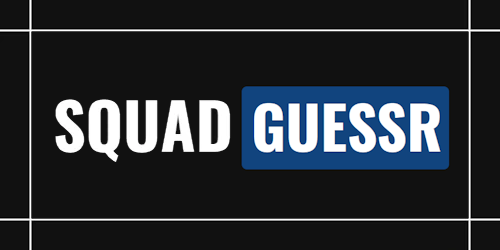
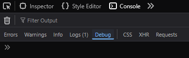
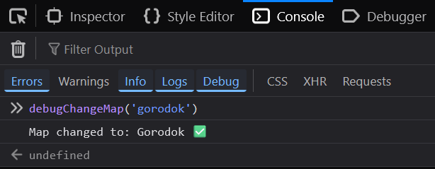
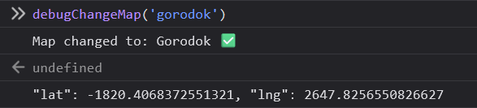

<h1 align="center">
    <a href="https://squadcalc.app">
      
    </a>
</h1>

<div align="center">
    <a href="https://discord.gg/BNPAc5kEJP">  
      </a>
</div>


</br>
</br>

# Submit a new guess 

</br>

1. Take your screenshot ingame (go into "screenshot mode" by clicking the eye icon at bottom of screen in main menu to remove compass, and Shift+P ingame for free camera), it should be a square and **at least 900px*900px**. Please consider taking your screenshots at quite high graphics settings for best UX on squadguessr. Using a screenshot tool like [GreenShot](https://getgreenshot.org/)/[ShareX](https://getsharex.com/) helps a lot.  
Format don't matter as i will convert everything to `.webp` with a script anyway.

3. Open console on your browser (F12)

4. Enable "Debug" logging

<div align="center"></div></br>

4. Start a new classic game to show any map, then in the console type `debugChangeMap('yourmapname')` to change the map to show the map you took your screenshot on

<div align="center"></div>

</br>

5. Click where your screenshot is taken from

<div align="center"></div>


</br>

6. Submit your screenshot + latlng on [Discord](https://discord.gg/BNPAc5kEJP) (suggestion channel), e.g. : 


```json
{ 
    "map": "narva",
    "mode": "easy",
    "url": "/img/guesses/yourimagename.webp",
    "lat": -1402.4167693765319,
    "lng": 1438.0344360576973,
    "submitter": "your preferred nickname/ingame-nick here"
},
```

</br></br></br>
# **Support the project**
</br>

[](https://buymeacoffee.com/sharkman)  


