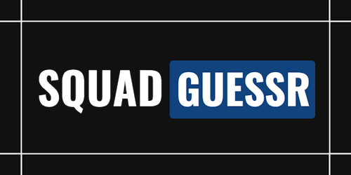

<h1 align="center">
    <a href="https://squadcalc.app">
      
    </a>
</h1>

<div align="center">
    <a href="https://discord.gg/BNPAc5kEJP">  
      </a>
</div>


</br>
</br>

# Submit a new guess 

</br>

1. Take your screenshot ingame (go into "screenshot mode" by clicking the eye icon at bottom of screen in main menu to remove compass, and Shift+P ingame for free camera). Its shorter side must be **at least 900px**. Please consider taking your screenshots at quite high graphics settings for best UX on squadguessr.
Using a screenshot tool like [GreenShot](https://getgreenshot.org/)/[ShareX](https://getsharex.com/) helps a lot.

2. Open SquadGuessr, click **SUBMIT A GUESS** in the menu and then **SUBMIT** (or go to `/?submit`).

3. Choose the map, paste your screenshot with Ctrl+V (or drop/choose the file), drag the square onto the part you want to show and click on the map where the screenshot was taken. Click **ADD** and repeat for more screenshots. Click a guess in the list to correct it, then **SAVE**.

4. Click **DOWNLOAD ZIP** and upload the ZIP on [Discord](https://discord.gg/BNPAc5kEJP) (suggestion channel).

</br>

## Reviewing submissions

Click **SUBMIT A GUESS** → **REVIEW** in the menu (or go to `/?review`), drop the ZIPs from Discord onto the page and accept (`A`) or reject (`D`) every guess. Images in a ZIP may be WebP, PNG or JPEG (up to 32 MB). **EXPORT** downloads one ZIP with the accepted guesses: `guesses.json` and the images under `img/guesses/`, every one turned into a 900×900 WebP (the centred square) under a new random name. **CLEAR** empties the review for the next batch. Every entry looks like this:

```json
{
    "map": "Narva",
    "mode": "easy",
    "url": "/img/guesses/PTWxNN2RRl9vC8G.webp",
    "lat": -1402.4167693765319,
    "lng": 1438.0344360576973,
    "submitter": "your preferred nickname/ingame-nick here"
}
```

</br></br></br>
# Multiplayer server

Group sessions ("Play with friends") need the small WebSocket server in `server/`.

**Development**

```bash
npm run server   # ws server on :3001 (MP_PORT to change)
npm start        # dev server proxies /mp to it, reachable from phones on the LAN
npm test         # server + scoring tests
```

**Production (Docker Compose)**

Your existing reverse proxy terminates TLS and forwards the domain to the `web` container:

```bash
cp .env.example .env   # optional, see variables below
docker compose up -d --build
```

| Variable | Default | |
|---|---|---|
| `WEB_BIND` | `127.0.0.1` | use `0.0.0.0` if the reverse proxy runs on another host |
| `WEB_PORT` | `8080` | point your reverse proxy here |
| `API_URL` | `https://squadguessr.app` | upstream for `/api/` (guesses and images) |
| `API_KEY` | empty | sent as `X-API-Key` if set |
| `SEARCH_ENGINES` | `false` | allow indexing in `robots.txt` |

The reverse proxy must pass WebSocket upgrades for `/mp` (Caddy and Traefik do this automatically; plain nginx needs `proxy_http_version 1.1` plus `Upgrade`/`Connection` headers; Nginx Proxy Manager: enable "Websockets Support").

Sessions live in memory only; `docker compose up -d --build` after an update restarts the server and ends all running sessions.

Guesses and images come from the public API at `https://squadguessr.app/api/v2/` without a key (`https://squadcalc.app` answers `403` for `/api/v2/get/squadGuess`).
Building the frontend outside Docker needs Node ≥ 20.9 (required by `copy-webpack-plugin`); the server and `npm test` run on Node 18.

</br></br>

# **Support the project**
</br>

[](https://buymeacoffee.com/sharkman)  


